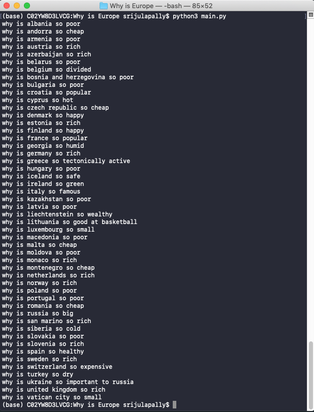

# Why is Europe

This is a super simple script that shows you what people search up about Europe, and is customizable. The program uses a Google search suggestions API to fetch the results. The default query is "Why is [country] so ____". This was mostly created for fun and doesn't have much of a purpose except for this.

 

The following python modules are required. You can download these with the pip package manager:

<ul>
  <li>requests</li>
</ul>

 

This is the result of the script with the default query, as of January 13, 2020

